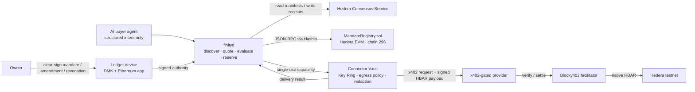

<p align="center">
  
</p>

# Finity

[](https://www.npmjs.com/package/@therick/finity)

> **Give AI agents Ledger-approved pocket money to buy services within rules they cannot break.**

Finity gives an AI agent bounded purchasing power without giving it payment keys or provider credentials. A human clear-signs one readable **Agent Mandate** on a Ledger device; a deterministic broker then enforces that mandate across every purchase.

The agent can discover x402 services, compare signed quotes, and pay in native HBAR—but only when the provider, service, method, asset, price, budget, data sensitivity, and expiry all match the signed rules. Every authorization and refusal becomes a signed, hash-chained receipt on Hedera Consensus Service (HCS).

[ETHOnline 2026](https://ethglobal.com/events/ethonline2026) · [Source](https://github.com/Ithaca-Labs/finity) · [Public trace](https://testnet.mirrornode.hedera.com/api/v1/topics/0.0.10423252/messages) · [Verified evidence](docs/VERIFIED.md)


## Why Finity exists

Giving an agent an unrestricted hot wallet makes a prompt-injection failure financially irreversible. Asking a human to approve every call removes the autonomy that makes agentic commerce useful.

Finity separates the roles instead:

- **Ledger grants authority.** The owner clear-signs the initial mandate, any amendment, and revocation. The physical device also authorizes initial funding, but it does not sign each service payment.
- **`finityd` enforces policy.** It evaluates structured purchase intent deterministically and fails closed on unknown providers, excessive prices, expired or revoked mandates, replayed capabilities, and disallowed data.
- **The Connector Vault controls secrets.** Ledger Wallet CLI Key Ring protects the broker bundle. The isolated vault signs only capability-scoped requests, restricts the destination, and redacts sensitive output.
- **The AI expresses intent.** It receives narrow Finity tools—not payment keys, raw credentials, or arbitrary authority.
- **Hedera makes the result auditable.** EVM contract state, native HBAR settlement, HCS discovery and receipts, and Mirror Node data let an independent verifier reconstruct what happened.

## Architecture



The critical path is:

```text
intent → discovery → signed quote → deterministic policy evaluation
       → on-chain reservation → single-use capability → x402 payment
       → delivery → reconciliation → HCS receipt chain
```

1. Services publish signed manifests to an HCS-backed directory using HCS-14 identity support from `@hashgraphonline/standards-sdk`.
2. The broker discovers compatible providers, requests signed quotes, and selects one deterministically.
3. The pure `@therick/policy-engine` checks the complete request in a fixed order. Time and policy state are explicit inputs.
4. `MandateRegistry.sol` reserves the approved amount before any payment, preventing concurrent requests from overspending the mandate.
5. `finityd` mints a single-use capability. The vault validates it, restricts egress, injects secrets only inside that request, and signs the x402 payment.
6. Blocky402 settles native HBAR. The broker finalizes the reservation after delivery or releases it on failure.
7. The verifier checks signatures, policy state, settlement data, HCS inclusion, and the receipt hash chain without trusting the AI.

## What the owner sees on Ledger

The Agent Mandate is EIP-712 typed data rendered as readable device fields, not an opaque hex blob. Signed display text is checked against the encoded values; a mismatch fails with `DISPLAY_MISMATCH`.

| Field | Example |
|---|---|
| Agent | `pi-buyer-agent` |
| Providers and services | `hello-weather@1`, `summarize-lite@1` |
| Methods | `weather.current`, `summarize.text` |
| Asset | `HBAR` |
| Per-request limit | `0.05 HBAR` |
| Period budget | `0.50 HBAR per 1h` |
| Lifetime budget | `1.00 HBAR total` |
| Data ceiling | `dataClass ≤ 0` |
| Expiration | `2026-09-13 18:00 UTC` |
| Escalation | `ESCALATE` |

One approval covers multiple compliant purchases. A budget-only failure may generate a proposed amendment for Ledger approval; other violations remain refused. The owner can revoke the mandate on-device at any time.

## Sponsor-track fit

### Ledger — AI Agents x Ledger

Finity uses Ledger Device Management Kit over USB for clear-signed EIP-712 authority and Ledger Wallet CLI Key Ring for the protected broker bundle. It implements the requested patterns directly: secrets the agent cannot leak, scoped capabilities instead of API keys, Ledger-secured x402 payments, and human approval before authority changes or funds are initially committed.

### Hedera — AI & Agentic Payments

Finity hosts an x402-gated service settled on Hedera testnet through Blocky402 and provides the agent platform that discovers and consumes it. Hedera is used at every major layer:

- native HBAR for the paid service request;
- Hedera EVM for mandate, reservation, budget, amendment, and revocation state;
- HCS for service discovery and signed hash-chained decision receipts;
- Mirror Node APIs for independent verification; and
- HCS-14 for the agent's on-chain identity.

## Live Hedera testnet evidence

These are public testnet records, not local fixtures:

| Artifact | Public evidence |
|---|---|
| `MandateRegistry` | [`0.0.10423109`](https://testnet.mirrornode.hedera.com/api/v1/contracts/0.0.10423109) · EVM `0xcbc39351ca205fd291b73d0c31904590c3098d89` |
| Service registry | [HCS topic `0.0.10423110`](https://testnet.mirrornode.hedera.com/api/v1/topics/0.0.10423110/messages) |
| Mandate decision trace | [HCS topic `0.0.10423252`](https://testnet.mirrornode.hedera.com/api/v1/topics/0.0.10423252/messages) |
| Broker spend account | [`0.0.10423102`](https://testnet.mirrornode.hedera.com/api/v1/accounts/0.0.10423102) |
| Provider accounts | [`0.0.10423105`](https://testnet.mirrornode.hedera.com/api/v1/accounts/0.0.10423105) · [`0.0.10423106`](https://testnet.mirrornode.hedera.com/api/v1/accounts/0.0.10423106) |
| 0.05 HBAR x402 settlement | [`0.0.7162784-1788898976-660100298`](https://testnet.mirrornode.hedera.com/api/v1/transactions/0.0.7162784-1788898976-660100298) |
| Ledger-signed revocation | [EVM result `0x6100…d3c9`](https://testnet.mirrornode.hedera.com/api/v1/contracts/results/0x6100b95d5275d75d43f0c9e6a8ae4510d8fef22d82e136a11ae4bcef9248d3c9) · [HCS envelope](https://testnet.mirrornode.hedera.com/api/v1/topics/0.0.8260226/messages?timestamp=1789294394.678990016) |

The recorded mandate was later revoked on a physical Ledger, so replaying the exact historical mandate should fail. That revocation is part of the proof.

## Run it

### Prerequisites

- Node.js 20 or newer
- pnpm 10
- Hedera testnet accounts and provider signing keys for live settlement
- `@ledgerhq/wallet-cli`, USB access, and a physical Ledger running the Ethereum app for the hardware flow

### Install and test

```bash
git clone https://github.com/Ithaca-Labs/finity.git
cd finity
pnpm install --frozen-lockfile
pnpm build
pnpm typecheck
pnpm test
cp .env.example .env
```

Populate `.env` using the [environment-variable guide](apps/console/content/docs/environment-variables.mdx). The repository builds and tests without funded accounts; a live matched-pair run requires the testnet, provider, broker-bundle, and active-mandate values described there.

### Run the matched pair

Start the two providers and broker:

```bash
FINITY_PROVIDER_A_PUBLISHED_AT=1789291700 \
FINITY_PROVIDER_B_PUBLISHED_AT=1789291700 \
pnpm dev:stack
```

In a second terminal, run the allowed request and then its one-field refusal:

```bash
FINITY_TESTNET=1 pnpm e2e:weather -- --city London
FINITY_TESTNET=1 pnpm e2e:weather -- --city London --data-class 1
```

`FINITY_TESTNET=1` is an explicit guard against accidental settlement. The timestamp overrides match the currently published manifests. For a fresh registry topic, set stable timestamps in `.env`, run `pnpm registry:seed`, and omit the overrides.

### Run the buyer agent

```bash
npm install --global @ledgerhq/wallet-cli @earendil-works/pi-coding-agent
pnpm build
pnpm agent
```

Ask Pi to buy weather for a city. `/finity` opens the control center for mandate state, remaining budgets, broker balance, connectivity, escalations, revocation, and withdrawal. Existing sealed broker bundles and compatible active mandates are reused; new authority returns to the Ledger flow.

### Run individual services

```bash
pnpm provider:weather       # hello-weather: 0.05 HBAR per call
pnpm provider:summarize     # summarize-lite: 0.01 HBAR per 1,000-character unit
pnpm --filter @therick/console dev
```

## The proof: one payment, one refusal

Finity's demo runs a matched pair of requests that differ by one policy-controlled field:

| Request | Policy result | Financial result |
|---|---|---|
| `weather.current:London`, `dataClass=0` | `AUTHORIZED` → `RECONCILED` | [0.05 HBAR settled](https://testnet.mirrornode.hedera.com/api/v1/transactions/0.0.7162784-1788898976-660100298) through Blocky402 |
| Same service and city, `dataClass=1` | `REFUSED: DATA_POLICY_VIOLATION` | **Zero reservation, zero payment, zero credential access** |

The authorized purchase (`f66ffcb2-2764-482d-861f-f51d69266ed3`) returned live London weather and produced a `DECISION → PAYMENT → USAGE → RECONCILED` receipt chain. The refusal (`f6447ab7-338c-4870-91a7-84691cd3c94d`) stopped before reservation. Both outcomes are recorded on the [public mandate trace topic](https://testnet.mirrornode.hedera.com/api/v1/topics/0.0.10423252/messages).

## Repository map

```text
packages/   schemas · mandate-compiler · policy-engine · capability
            trace-builder · verifier · negotiator · registry-client
            commerce-adapter · vault-worker · finityd · provider-sdk
            pi-package · finity-cli
contracts/  MandateRegistry.sol and Hardhat tests
services/   hello-weather · summarize-lite
apps/       console landing page and documentation
scripts/    matched-pair E2E · registry seed · testnet bootstrap · local stack
docs/       verified evidence · architecture · decisions · Ledger DX feedback
```

## Implementation notes

Finity is a strict TypeScript monorepo built with Node.js, pnpm workspaces, Zod, Vitest, Solidity 0.8.24, Hardhat 3, ethers, and viem. Package APIs are exposed through `src/index.ts`, and each package follows a trust boundary.

Two less-visible engineering details matter:

- Pi's `jiti` loader failed on static imports from the Ledger signer package with `Cannot redefine property: module.exports`. Ledger SDK imports were moved into the dynamic signing path after bisecting the import graph.
- The complete EIP-712 mandate hash exceeded the Solidity compiler's normal stack limit, so the contract build uses `viaIR`. Hardhat tests cross-check the contract digest against ethers.

For the complete technical record, see [architecture](docs/ARCHITECTURE.md), [verified evidence](docs/VERIFIED.md), [design decisions](docs/DECISIONS.md), and [Ledger developer-experience feedback](docs/DX_FEEDBACK.md).
